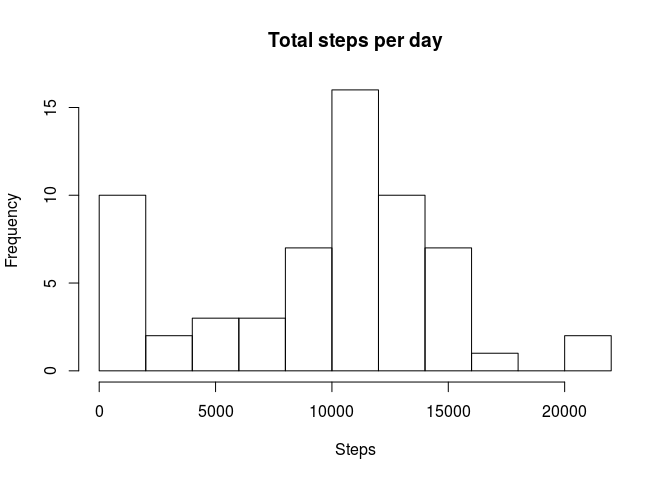
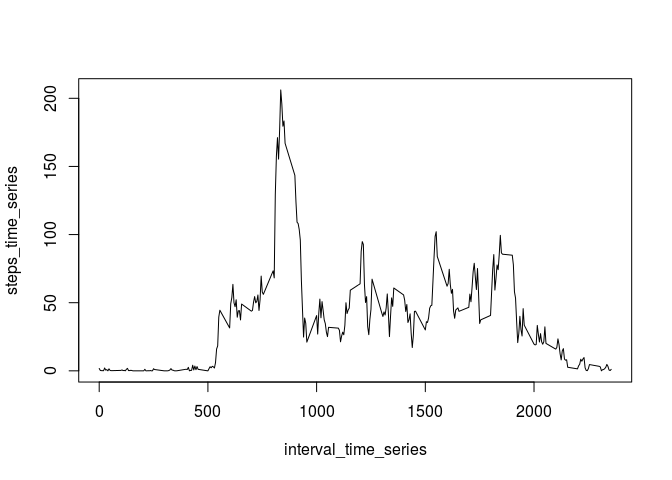
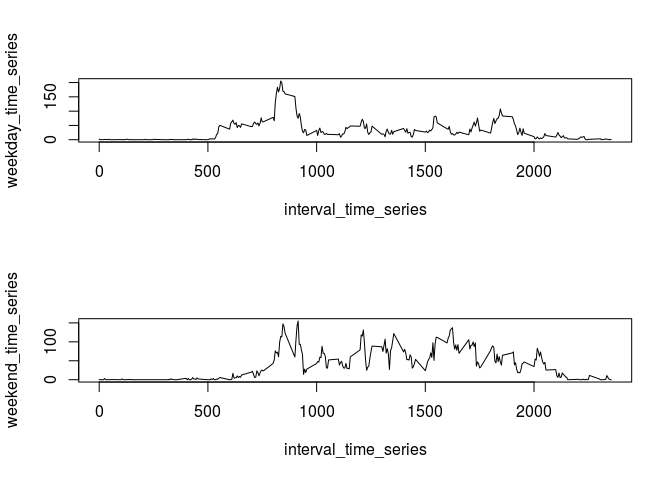

# Reproducible Research: Peer Assessment 1

## Preliminary

I am working on a Linux Ubuntu system, using RStudio, and the bash shell.

## Loading and preprocessing the data

For simplicity, I first unzipped the `activity.zip` file,
so that a simple `read.csv` method call could open it.

```
# This is bash
$ mkdir data
$ unzip activity.zip -d data
```

Then, from an R environment, I can directly read data as in:


```r
data <- read.csv("data/activity.csv")
summary(data)
```

```
##      steps                date          interval     
##  Min.   :  0.00   2012-10-01:  288   Min.   :   0.0  
##  1st Qu.:  0.00   2012-10-02:  288   1st Qu.: 588.8  
##  Median :  0.00   2012-10-03:  288   Median :1177.5  
##  Mean   : 37.38   2012-10-04:  288   Mean   :1177.5  
##  3rd Qu.: 12.00   2012-10-05:  288   3rd Qu.:1766.2  
##  Max.   :806.00   2012-10-06:  288   Max.   :2355.0  
##  NA's   :2304     (Other)   :15840
```


## What is mean total number of steps taken per day?

In order to figure out the average number of steps,
I will use the `aggregate` R convenience function.
This step will be wrapped in an R function for reuse at a later step.


```r
daily_analysis <- function(df){
  total <- aggregate(df$steps, by=list(date=df$date), FUN=sum, na.rm=TRUE)
  colnames(total)[2] <- "total"

  #histogram plot
  hist(total$total, main="Total steps per day", xlab="Steps", breaks=10)

  # mean and median output
  mean_total = mean(total$total, na.rm=TRUE)
  median_total = median(total$total, na.rm=TRUE)
  setNames(c(mean_total, median_total),c("Mean", "Median"))
}

daily_analysis(data)
```



```
##     Mean   Median 
##  9354.23 10395.00
```


## What is the average daily activity pattern?

In order to find the daily average of activity,
I will reuse the `aggregate`approach, this time grouping by interval.


```r
daily_mean_steps <- aggregate(data$steps, by=list(interval=data$interval), FUN=mean, na.rm=TRUE)
colnames(daily_mean_steps)[2] <- "daily_mean"

steps_time_series <- ts(daily_mean_steps$daily_mean)
interval_time_series <- ts(daily_mean_steps$interval)
plot(interval_time_series, steps_time_series, type="l")
```



The highest levels of activity are seen during eary morning.

The interval with the most activity can be obtained by:


```r
daily_mean_steps[which(daily_mean_steps$daily_mean == max(daily_mean_steps$daily_mean)),]
```

```
##     interval daily_mean
## 104      835   206.1698
```


## Imputing missing values

There is a significant number of missing data from the `steps` column:


```r
sum(is.na(data$steps))
```

```
## [1] 2304
```

That, is, approximately 13.1147541%

As suggested in the rubric, I will replace missing data with the daily median value for that interval
as an imputing strategy:


```r
#median
daily_median_steps <- aggregate(data$steps, by=list(interval=data$interval), FUN=median, na.rm=TRUE)
colnames(daily_median_steps)[2] <- "daily_median"
#fresh copy
curated_data <- data[,]
curated_data <- merge(curated_data, daily_median_steps,by.x="interval")
curated_data <- curated_data[with(curated_data, order(date, interval)),]
curated_data$steps <- with(curated_data, ifelse(is.na(steps), daily_median, steps))

#analyze the data
daily_analysis(curated_data)
```


```
##      Mean    Median 
##  9503.869 10395.000
```

Since most of the `steps`values are zero, the median for the daily total doesn't change (as most intervals with missing data get their values replaced by zero).
However, the daily mean does indeed raise a small fraction.

## Are there differences in activity patterns between weekdays and weekends?

The last rubric requires to analyze differences between weekdays and weekends.


```r
#make it locale invariant!
Sys.setlocale("LC_TIME","C")
```

```
## [1] "C"
```

```r
weekdays <- c('Monday', 'Tuesday', 'Wednesday', 'Thursday', 'Friday')
curated_data$date <- as.Date(curated_data$date)
curated_data$week_day <- factor((weekdays(curated_data$date) %in% weekdays), levels=c(FALSE, TRUE), labels=c('weekend','weekday'))
```

For the grand finale of this analysis, I will segregate the data into a 
weekday daily average and a weekend daily average to check for behavior difference.


```r
curated_data_weekday <- curated_data[as.character(curated_data$week_day) == 'weekday',]
curated_data_weekend <- curated_data[as.character(curated_data$week_day) == 'weekend',]

weekday_mean_steps <- with(curated_data_weekday,aggregate(steps, by=list(interval=interval), FUN=mean, na.rm=TRUE))
colnames(weekday_mean_steps)[2] <- "daily_mean"

weekend_mean_steps <- with(curated_data_weekend,aggregate(steps, by=list(interval=interval), FUN=mean, na.rm=TRUE))
colnames(weekend_mean_steps)[2] <- "daily_mean"

weekday_time_series <- ts(weekday_mean_steps$daily_mean)
weekend_time_series <- ts(weekend_mean_steps$daily_mean)
interval_time_series <- ts(weekday_mean_steps$interval)

par(mfrow=c(2,1))
plot(interval_time_series, weekday_time_series, type="l")
plot(interval_time_series, weekend_time_series, type="l")
```



As can be seend from the plot, on a weekday activity is likely to begin earlier than in the weekends.
However, activity is in general at a more even level during the weekend.
